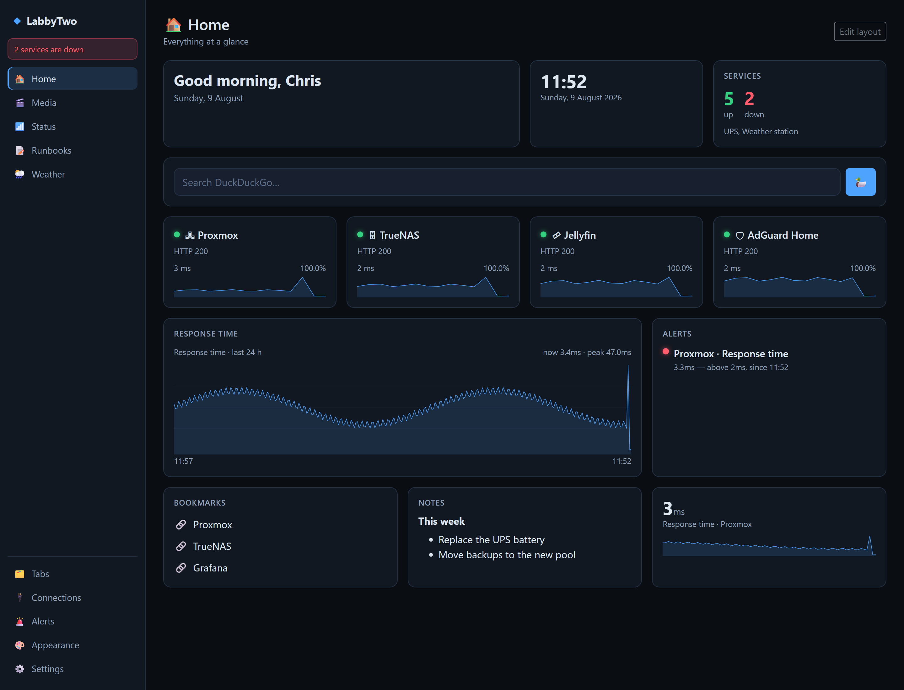
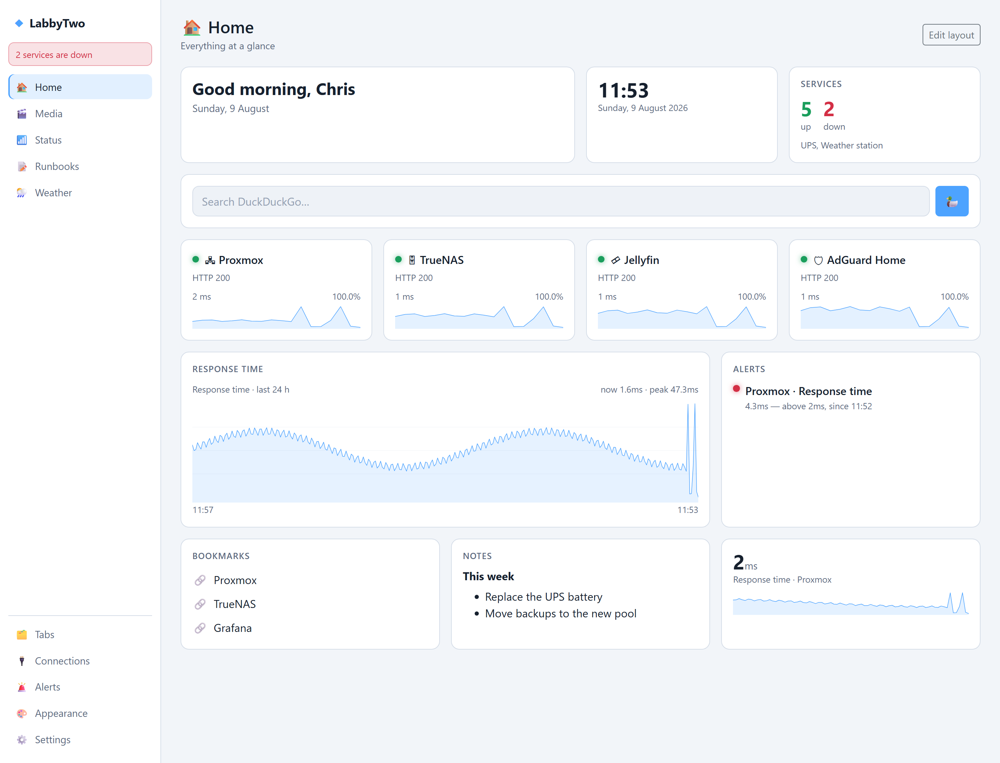
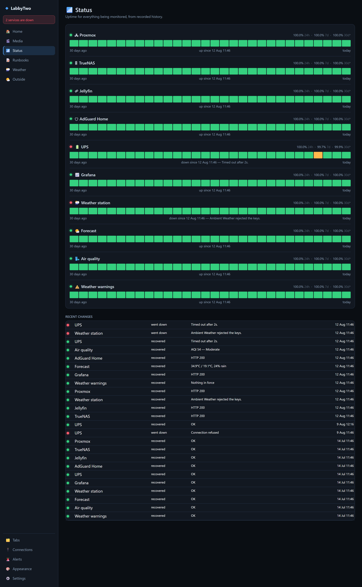
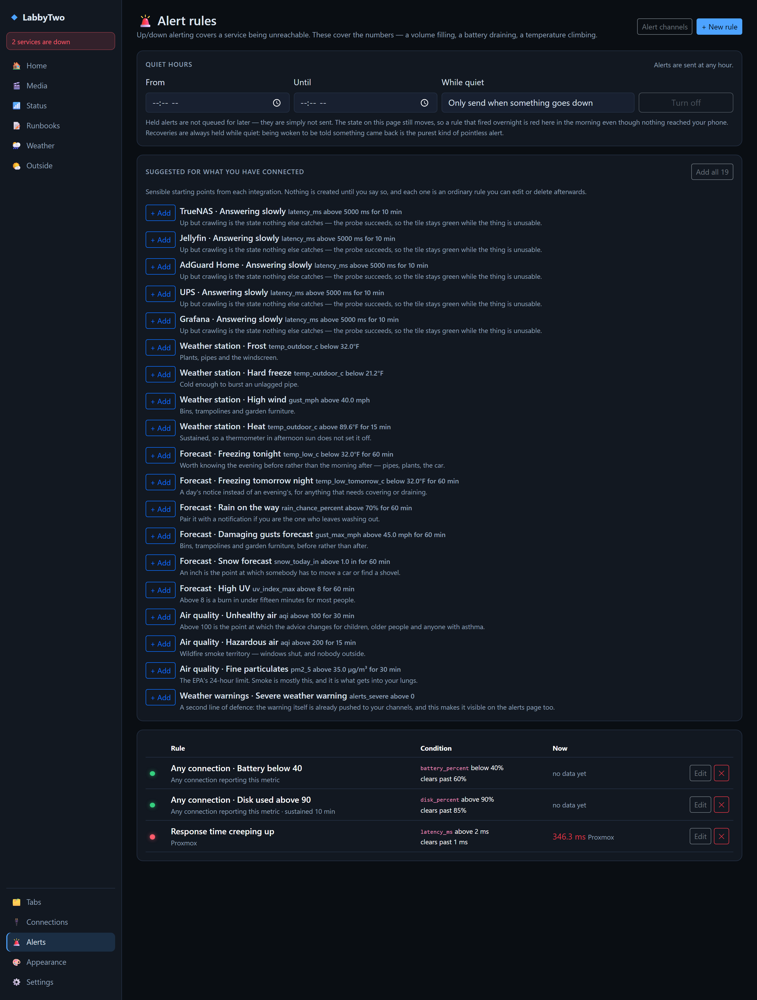
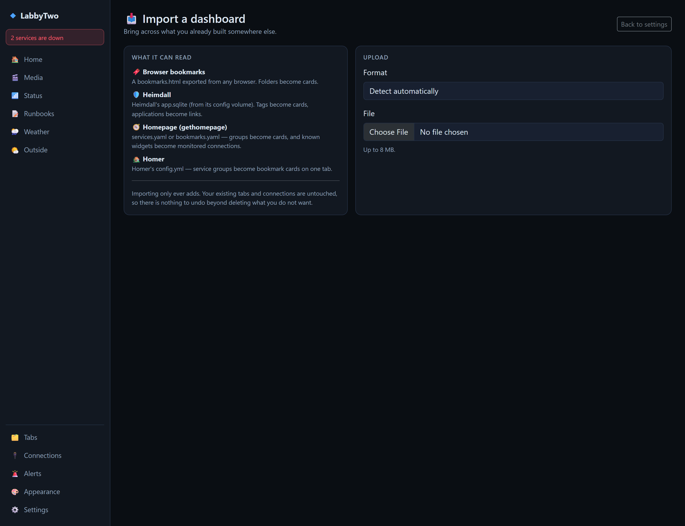
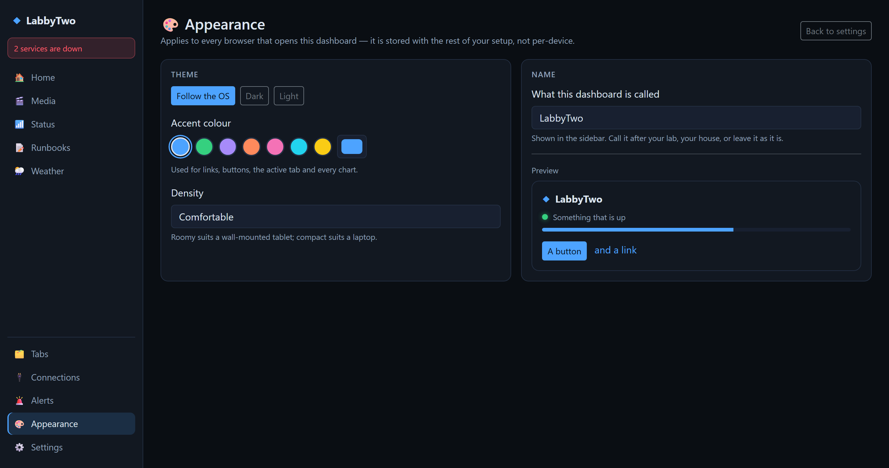
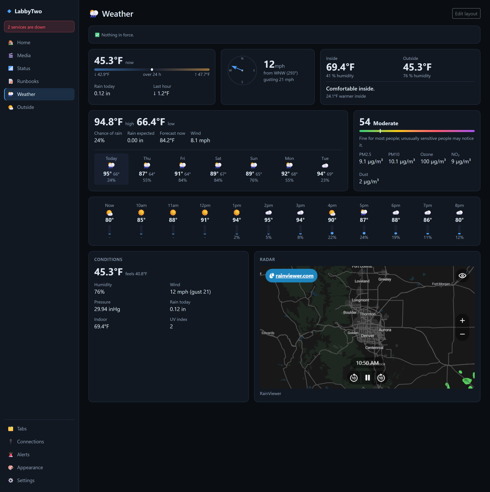
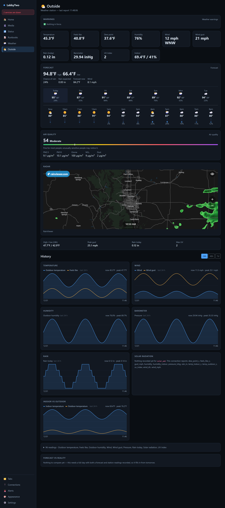
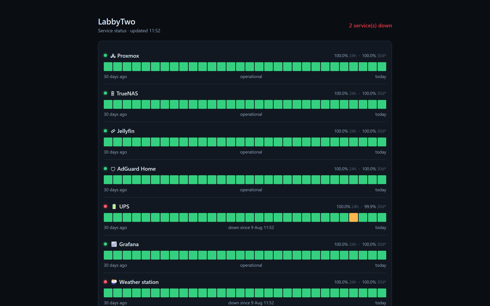

# LabbyTwo ◆

A home lab start page where **nothing is hardcoded**. Tabs, what's on them, and everything
it talks to are all added from the web interface and stored in one SQLite file. There is
no config file to edit, no image to rebuild, and no restart.

If you have used a dashboard that shipped with somebody else's services baked into
`appsettings.json`, this is the answer to that.



<details>
<summary>The same dashboard in light mode, and a few other screens</summary>



**Status page** — uptime for everything monitored, and every time something changed state.



**Alert rules** — thresholds on any metric from any provider.



**Import** — read what you already built in Homer, Homepage, Heimdall or your browser.



**Appearance** — theme, accent, density and what the dashboard is called.



</details>

<sub>Screenshots are generated by <code>docs/make-screenshots.py</code> against a throwaway
demo database, so they stay honest as the app changes.</sub>

---

## Install

```bash
curl -fsSL https://raw.githubusercontent.com/chrisdfennell/LabbyTwo/main/install.sh -o install.sh
less install.sh      # it is somebody else's script and it runs Docker. Read it first.
bash install.sh
```

Windows, with Docker Desktop:

```powershell
irm https://raw.githubusercontent.com/chrisdfennell/LabbyTwo/main/install.ps1 -OutFile install.ps1
notepad install.ps1
.\install.ps1
```

It **asks where to put it** (defaulting to `~/labbytwo`), checks Docker is running, writes
a `.env` with your timezone, builds, starts, and waits until the app actually answers
before telling you it worked. **Run it again later to update** — it pulls, rebuilds and
restarts, and never touches your `.env` or your data.

Only the source lives in that directory. Your dashboard, credentials and history are in a
Docker volume, so the checkout can go on any disk and you can move it later.

To skip the prompt — for a script, a cron job, or CI — set the directory up front:
`LABBY_DIR=/opt/labbytwo bash install.sh`, or `.\install.ps1 -Dir D:\labbytwo`. Add
`LABBY_PORT=5151` / `-Port 5151` if 5150 is taken.

### Releases, or main

It installs the **newest tagged release** by default, so a fresh install gets a version
somebody decided was ready rather than whatever landed on `main` an hour ago. To follow
`main` instead — for a fix that is merged but not released yet:

```bash
LABBY_CHANNEL=main bash install.sh      # or  .\install.ps1 -Channel main
```

Whichever you pick, the build is stamped with what it is, and **Settings → Updates**
compares against the right thing: a release install against the newest release, a `main`
install against the tip of `main`. A build tracking main is deliberately *ahead* of the
last release, and reporting that as "behind" would be backwards.

| | Version shown in Settings | Compared against |
|---|---|---|
| Release channel | `v1.0.0` | the newest published release |
| Main channel | `v1.0.0-3-gabc1234` — three commits past v1.0.0 | the tip of `main` |
| Built by hand | `not stamped` | nothing; there is nothing to compare |

Published images follow the same split: `:latest` is the newest **release**, `:main` is
the newest commit, and every release also gets its own `:v1.0.0` tag. If you pull images
rather than building, `:latest` will not quietly move you onto main.

**Changing the Compose setup?** Put it in `docker-compose.override.yml` rather than
editing `docker-compose.yml` — Compose merges it automatically, it is gitignored, and
updates leave it alone. `docker-compose.override.yml.example` covers the usual cases:
joining another stack's network so you can reach its containers by name, `extra_hosts`
for names your NAS resolves but a container cannot, and mounting the Docker socket.

That first one bites on a NAS in particular. Container Station gives each stack its own
bridge, and the firmware will not always forward between them — so a service that answers
fine from a shell on the NAS times out from inside LabbyTwo. Join its network and use
`http://sonarr:8989` instead of the host's IP.

Confusingly, the host's IP *does* work for anything native or host-networked — Plex, the
NAS's own admin UI — because those are not published container ports being routed back in.
So some connections work by IP and others do not, on the same box.

For a container that is not in a stack of its own, attach it to a network you share
rather than moving it:

```bash
docker network connect media-stack ersatztv
```

That takes effect immediately, but not across a recreate — add the network to that
container's own compose file to make it stick.

**No git?** Fine — NAS firmware like QNAP Container Station and Synology ships Docker
without it. The script falls back to downloading a tarball, and updates still work.
It needs Docker plus either git, or curl/wget and tar.

Or do it by hand, which is all the script does:

```bash
git clone https://github.com/chrisdfennell/LabbyTwo.git && cd LabbyTwo
cp .env.example .env      # optional — set a timezone, a port and a password
docker compose up -d
```

Then open <http://localhost:5150>, click **Create a starter dashboard**, and start adding
things.

Without Docker: `dotnet run`, then open the URL it prints.

Images are built for `linux/amd64` and `linux/arm64`, so a Raspberry Pi or an ARM NAS
works the same as an Intel box.

### Already have a dashboard?

**Settings → Import a dashboard** reads what you already built somewhere else, so you are
not retyping thirty bookmarks to try this.

| From | Upload | What comes across |
|---|---|---|
| **Homer** | `config.yml` | Every service group becomes a bookmark card on one tab. |
| **Homepage** | `services.yaml`, `bookmarks.yaml` | Groups become cards — and a service with a `widget:` block for Sonarr, Radarr, Plex or Pi-hole becomes a *monitored connection*, API key and all, not just a link. |
| **Heimdall** | `app.sqlite` | Tags become cards, applications become links. |
| **Any browser** | `bookmarks.html` | Folders become cards. Chrome, Firefox, Edge, Safari. |

Nothing is overwritten — an import only ever adds — and you see exactly what it found
before you commit to it.

---

## The three ideas

Everything in LabbyTwo is one of three records, all editable from the UI.

### Connections — things it talks to

A connection is one instance of a *provider*: your NAS, your Plex, or just a URL. Adding
one shows a form generated from that provider's own field list, plus a **Test connection**
button that runs the exact same probe the monitor will run — so a green test means
monitoring works.

**⧉ Duplicate** takes everything across including the credentials, and opens the editor on
the copy so you can change the one field that differs. Nothing is written until you save.

Past six connections the page grows a **filter**, a **Down only** toggle, **Test all**, and
a checkbox on every row. What you tick can be enabled, disabled, silenced or deleted
together — and select-all takes what the filter is *showing*, never everything, so "Down
only → select all → Silence" means the rows in front of you and not the twenty behind them.

| Provider | What it reports |
|---|---|
| **Web service** | Any HTTP(S) URL — response time, status code, optional body match. Use this for anything without a dedicated integration. |
| **JSON API** | Any endpoint returning JSON. Pull numbers out with dotted paths (`sensors.cpu.temp`, `disks[0].used`) and they become metrics like any other. |
| **Ping host** | ICMP round-trip time, for boxes with no web UI. |
| **Proxmox VE** | Node CPU, memory, root filesystem, uptime, and how many VMs and containers are running. |
| **TrueNAS** | Version, uptime, pool health and how full the fullest pool is. |
| **Home Assistant** | Any entity you name becomes a metric — temperatures, power, battery, door sensors. |
| **UniFi** | Clients connected, devices adopted and offline, WAN throughput. |
| **AdGuard Home** | Queries and blocks today and whether protection is on — same metric names as Pi-hole. |
| **Jellyfin** | Server version, who is streaming, and what is being transcoded. |
| **qBittorrent** | Transfer rates and how many torrents are downloading or seeding. |
| **UPS (NUT)** | Battery charge, runtime left, load, input voltage, and whether it is on battery. |
| **Docker** | How many containers are running, and a live list. Needs the socket mounted. |
| **Prometheus** | Any number you can write a query for. One connection covers every exporter you already scrape, so node_exporter, cAdvisor and blackbox all arrive without an integration each. |
| **Uptime Kuma** | Monitors up, down and paused, each one by name, and the nearest certificate expiry. Reads Kuma's `/metrics`. |
| **Proxmox Backup Server** | Datastore usage, snapshot count, and hours since the newest backup — the number that catches a job which stopped running. |
| **Duplicati** | Backup jobs, when each last ran, and whether the last run failed. |
| **Scrutiny** | SMART health per disk: how many are failing, the hottest, and the oldest. |
| **Frigate NVR** | Cameras alive, detection rate, detector speed, recordings disk. A camera at zero frames is a silent failure nothing else notices. |
| **Tailscale** | Devices on the tailnet, how many are online, and the nearest node-key expiry. |
| **Synology NAS** | DSM system info, temperature, CPU and memory load, and volume usage. |
| **Internet speed test** | Runs its own download, upload and latency test on a schedule you set. Nothing to install, no API key, and the same metric names as Speedtest Tracker — so a chart or an alert rule survives switching between them. |
| **Speedtest Tracker** | Latest download, upload, ping and jitter — plus how old that result is, which is what catches a scheduler that has stopped. |
| **Immich** | Photos and videos in the library, what it takes on disk, and how full that disk is. |
| **Nextcloud** | Users, files, shares, free space and load, from the Server info app. |
| **MyPersonalGit** | A self-hosted [MyPersonalGit](https://github.com/chrisdfennell/MyPersonalGit) server — repositories, open pull requests, open issues and stars. Token auth. |
| **Gitea / Forgejo** | The same, for Gitea, Forgejo or Gogs — one integration, because all three still answer the same API. |
| **GitLab** | Projects, open merge requests, open issues and stars from a self-hosted GitLab. It says *merge request* where the others say pull request, because that is what GitLab calls them. |
| **Pi-hole** | Queries and blocks today, block percentage, and whether blocking is switched on. **Pauses and resumes blocking**, given an API token. |
| **QNAP NAS** | Model, firmware, uptime, CPU, memory, temperatures, fan speeds, volume usage, SMART health per drive, and whether a firmware update is waiting. **Restarts, shuts down and wakes the NAS.** |
| **Ambient Weather** | Every reading the station sends — indoor/outdoor temperature, wind, rain, pressure, UV. |
| **Sonarr** / **Radarr** / **Lidarr** / **Readarr** | Version, reachability, and download queue depth. |
| **Prowlarr** | Version and reachability for your indexer manager. |
| **Plex** | Server version and what is playing right now. |
| **Tautulli** | Active Plex streams, how many are transcoding, and total bandwidth. |
| **Bazarr** | How many episodes and movies are still missing subtitles. |
| **Seerr** | Requests pending, approved and available. Formerly Overseerr and Jellyseerr. |
| **NZBGet** | Download rate, queue size, free disk, and whether it is paused. |
| **ErsatzTV** | Reachability and how many channels it is publishing. |
| **Unmanic** | Pending tasks and how many workers are busy. |
| **Webhook** | *Alert channel.* Discord, Slack or ntfy — the payload shape is detected from the URL. |
| **Pushover** | *Alert channel.* Push notifications to your phone. |
| **Healthchecks** | Scheduled jobs that have stopped checking in. Catches the cron that silently stopped, which nothing else here can see. |
| **Cloudflare Tunnel** | Whether your tunnels are healthy and how many connectors each has — the outage nobody on the LAN can see. |
| **OPNsense** | Gateway packet loss and latency, WAN addresses, memory. The router is never "down"; it just starts dropping things. |
| **Shelly** | Power draw, energy used and temperature, straight off the plug. No cloud, no broker. Gen1 and Gen2 both. |
| **Weather forecast** | Up to sixteen days of highs, lows, gusts, UV and snow from Open-Meteo, plus the next 48 hours one hour at a time. No API key, and the half a weather station cannot tell you. |
| **Weather warnings (US)** | Tornado, flood, winter-storm and heat warnings from the National Weather Service, pushed to your alert channels within five minutes — and past quiet hours when they are severe. |
| **Air quality** | AQI, PM2.5, ozone and dust from Open-Meteo, with the band and the health advice spelled out. No API key. |
| **SABnzbd** | Queue size, speed, what is left, free disk, and whether it is paused. |
| **Transmission** | Torrents active and transfer rates. Handles the session-id handshake for you. |
| **Tdarr** | Transcode and health-check queues, workers busy, space saved. Falling behind looks exactly like working. |
| **Mylar3** | Comic series tracked and issues still wanted. |
| **Whisparr** | Version, reachability and queue depth, like the other *arrs. |
| **Komga** | Series, books and how many are unread. |
| **Audiobookshelf** | Libraries, items, and how many are part-listened. |
| **Navidrome** | Albums, songs, and who is playing something right now. |
| **Email (SMTP)** | *Alert channel.* Any SMTP server. The one that needs nothing else installed. |
| **IFTTT** | *Alert channel.* Fires an applet, so an alert can turn a light on rather than only say something. |
| **GitHub** | GitHub or GitHub Enterprise — repositories, open pull requests and issues, on the same page as your self-hosted forges. You choose the scope: what you own, a user's, an organisation's, or just the ones you name, because a token can see far more than belongs on a dashboard. |
| **TLS certificate** | Days until a certificate expires, and who issued it. The outage that gives no warning: automatic renewal fails *silently*, and the only sign is a number counting down that nobody is watching. |
| **MQTT broker** | Any broker — Zigbee2MQTT, Tasmota, ESPHome. Subscribes and turns messages into metrics: `name = topic:path`, the same shape the JSON API provider already used. The one integration here that holds a connection open rather than asking. |

### Controls — the ones that do something back

Most providers only read. A few can also be told to do something, and where they can, the
buttons appear on their own: next to **Test** on the Connections page, and on a **Controls**
card if you want them on a dashboard. There is nothing to configure — the action runs
through the connection, with the credentials it already has, which is the difference
between this and the Action button card (that one is a URL you assemble yourself).

Today that means:

| Connection | Can be told to |
|---|---|
| **QNAP NAS** | Restart · shut down · wake on LAN |
| **Pi-hole** | Pause blocking for a while · resume blocking |

Three things happen around every one of them, so no provider has to remember them:

- **It asks first.** On by default, and anything marked dangerous cannot opt out — a
  dashboard button is a button a child leaning on a wall tablet can press.
- **It stops the alert you caused.** Restarting the NAS silences that connection for
  fifteen minutes, and shutting it down until tomorrow. The monitor has no way to tell a
  reboot you asked for from an outage, and being paged about a machine you personally
  turned off is how people learn to ignore alerts. If the request fails, the silence is
  lifted again — a machine that is genuinely down still has to be able to say so.
- **It only offers what can work.** Wake on LAN does not appear until you have put a MAC
  address on the connection, and Pi-hole's controls stay hidden until it has an API token.
  A button that cannot work is worse than no button: it is indistinguishable from a broken
  one.

Wake on LAN is the one with a wrinkle. It broadcasts a magic packet from wherever LabbyTwo
is running, so a container on a bridge network will not reach your LAN — that one needs
host or macvlan networking. Enable it on the NAS first, under Control Panel → System →
Power.

### Alerts you can leave switched on

Monitoring forty things makes a dashboard worse, not better, unless something decides what
is worth saying. Five things do:

- **Quiet hours** — between the times you set, only a service actually going down gets
  through, or nothing at all. Recoveries are always held: being woken to be told something
  came back is the purest kind of pointless alert. A severe weather warning is the one
  exception and is always sent, because "do not wake me" is the wrong answer to a tornado.
- **Silences** — "stop telling me about this for an hour", from the connections list or
  `Ctrl+K`, for the hour you spend restarting the thing on purpose.
- **Silence all** — the same thing for the whole installation, for when *you* are the one
  breaking it. Rebooting the NAS takes fifteen services down inside a minute, and quiet
  hours are no help at two on a Saturday afternoon. It is on `Ctrl+K` as well as the
  connections page, because you reach for it on the way to unplug something. While it is
  on, a banner on every page says so and carries the way out — which is what makes "until I
  resume" a safe option to offer here and not on a single connection.
- **Dependencies** — a connection can sit *behind* another. While the VPN gateway is down,
  the ten containers behind it stay quiet, and the one message you get names the gateway.
- **Routing** — each rule can name a channel, so the disk-space rule goes to email and the
  front door goes to your phone.

Held alerts are not queued for later; they are simply not sent. The Alerts page still shows
the real state, so a rule that fired overnight is red in the morning.

Every connection is probed on a timer (30s by default). Whatever numbers a provider
returns are recorded to SQLite, which is why **any** provider gets uptime tracking and
charts without a line of chart-specific code. Providers also say how their numbers should
read — units, labels, precision — so a new integration's metrics look right on a tile
without touching anything else.

A provider can also say how often it is *worth* asking, and the weather ones do. Open-Meteo
recomputes hourly, so the forecast and air quality are polled every fifteen minutes rather
than every thirty seconds: the answer would be the same 119 times out of 120, and the
120th would be a quota error. Everything that answers from your own network is still asked
every sweep.

The **JSON API** provider is the one that makes "add your everything" true. Point it at
any endpoint that returns JSON, list the numbers you want as `name = path`, and they
become tiles, charts and alert-able metrics — no code, no restart:

```
cpu_temp = sensors.cpu.temp
ssd_used = disks[0].used
fan      = fan_running
```

Booleans count as 1 and 0, quoted numbers are parsed, and an optional **status path**
decides up or down from a field like `"state": "online"`. A UPS daemon, a 3D printer, a
solar inverter, some appliance with an undocumented `/api/stats` — all monitorable
without anyone writing a provider for them. The names you invent show up in the metric
picker, and a trailing unit in the name is understood: `fan_rpm` reads as `1200rpm` with
nothing declared.

Credentials are encrypted at rest with the app's data-protection keyring, which lives
next to the database in the same volume. A copied database is not a pile of plaintext
passwords, and the password box never echoes a stored secret back to the browser.

### Alerting

Two kinds, both delivered through the same channels.

**Up and down.** Every service that changes state sends a notice — 🔴 with the failure reason when something goes
down, 🟢 with how long it was out when it comes back. Alert channels aren't probed (there is
nothing meaningful to poll), so instead of a Test button they get **Send test
notification**, which delivers a real message. Any single connection can be muted without
un-monitoring it, and a restart never announces everything you own.

**Thresholds.** The failures that matter are usually gradual, not a service vanishing — a
volume filling, a UPS draining, a temperature climbing. **Settings → Alerts** puts a rule
on any number any provider reports:

> `disk_percent` **above** `90`, sustained `10` minutes, clears past `85`

Because it works on metrics rather than on any particular integration, one rule covers
every provider that reports that number — including ones written after the rule. Leave the
connection unset and it watches *everything* reporting the metric, so a NAS added next
month is covered with no edit.

Two details that stop alert fatigue: **sustained for N minutes** ignores the spike your
nightly backup causes, and **clears past** is a separate recovery threshold, so a metric
sitting exactly on the line cannot alert, recover, and alert again every thirty seconds.

You should not have to work out which numbers matter, either. Each integration **suggests
its own rules** — a UPS offers "running on battery" and "battery low", a weather station
offers frost and high wind, TrueNAS offers "pool not healthy" and warns at 80% because
that is where ZFS starts to slow down. They are listed on the Alerts page with a reason
each, nothing is created until you say so, and once added they are ordinary rules you can
edit or delete.

Alert channels are connections too. Add a webhook or Pushover channel and both kinds start
being delivered — there is no separate notification settings screen.

### Tabs — what's in the nav

The sidebar is literally a table. Add, rename, reorder, hide, delete — and **Sort** puts a
nav that grew in no particular order into one, A–Z or by kind. **Duplicate** makes another
tab like this one, cards and bindings and all. Seven kinds ship:

- **Dashboard** — a grid of widgets.
- **Embedded page** — a full-height iframe of another app's web UI. One tab kind covers
  Portainer, code-server, a web terminal, whatever — no integration required.
- **Notes** — markdown notes and runbooks with a live preview. It points out headings
  written without their space — `##Wi-Fi` is a paragraph, not a heading, and CommonMark
  is right about that in a way that is baffling when you are staring at the preview.
- **Git server** — a whole page for one Git server: counts, every repository with its
  commit, pull request and issue tallies, and what is open across all of them. MyPersonalGit,
  Gitea, Forgejo or GitLab — the page asks for *a forge*, not a brand, so a provider added
  later joins it without the page being touched.
- **Weather station** — a whole page for the weather where you are: any warnings in force
  at the top, current readings from your own station, the forecast by day and by hour, air
  quality, radar, today's extremes with sunrise and sunset, seven charts over 24h / 48h /
  7d, the raw readings, and how yesterday's forecast scored against your thermometer.
  Everything except the station's own half works without a station. Built from the same
  widgets a dashboard tab can use, arranged for you.
- **Media stack** — a whole page for the *arrs and everything around them: what needs a
  look, what is streaming across every media server at once, every *arr calendar merged
  and sorted by date, the download queues on one list, your download clients side by side,
  library counts, and graphs of streams, transcoding, throughput, queue depth and library
  growth. It names no connections — it gathers every one whose integration calls itself
  Media or Downloads, so the eighth *arr you add appears on it by itself. Built from the
  same widgets a dashboard tab can use, arranged for you.
- **Status page** — uptime for everything monitored: 24h/7d/30d percentages, a daily bar
  strip, and a log of every time something went down or came back. Percentages are
  measured from when monitoring actually started, marked `*`, rather than crediting a
  service for time before you added it.

### Widgets — what's on a dashboard tab

Hit **Edit layout** on any dashboard tab to add, rearrange, resize and remove cards. The
picker only offers widgets that can actually work with the connections you have, and
greys out the rest with the reason.

| Widget | Binds to |
|---|---|
| Service tile | any connection — status dot, response time, 1h sparkline, 24h uptime |
| Metric | any connection — one number, big |
| Gauge | any connection — one reading as a bar, with a warning mark: how full, how charged, how hot |
| Chart | any connection — any recorded metric over time |
| Chart across connections | nothing — one metric from several connections on one axis: CPU on every host |
| Total across connections | nothing — one metric summed, averaged or maxed: free space across both NASes |
| Uptime | any connection — the percentage, with a bar per day behind it so the figure has a shape |
| Recent changes | any connection, or nothing to watch everything — what went down or came back |
| Status summary | nothing — how many connections are up/down |
| Active alerts | nothing — which threshold rules are breached, and by how much |
| Search | nothing — a search box for any engine, or your own SearXNG |
| Bookmarks | nothing — a list of links, with each site's own icon fetched for it |
| Greeting | nothing — good morning, and the date. The wording of each part of the day is yours to change |
| Text / Markdown | nothing |
| Embedded page | nothing — an iframe in a card |
| Camera | nothing — a still image or MJPEG stream, loaded by your browser |
| Action button | nothing — a button that calls a URL: an n8n flow, a Home Assistant scene |
| Controls | any connection that has any — the buttons the provider itself offers, using credentials it already has |
| Media — now playing | nothing — everything streaming, across every media server at once |
| Media — coming up | nothing — every *arr calendar merged and sorted, with what you already have marked |
| Media — the queue | nothing — every *arr's download queue on one list |
| Media — download clients | nothing — SABnzbd, NZBGet, qBittorrent and Transmission side by side |
| Media — library size | nothing — counts from every library server that reports one |
| Media — needs a look | nothing — paused downloaders, missing subtitles, requests waiting, anything not answering |
| Internet speed | Internet speed test, Speedtest Tracker — download, upload, ping and jitter together, how old the result is, and a week of both speeds on one zero-based axis |
| Clock | nothing |
| Weather station | Ambient Weather — current conditions |
| Weather — today's extremes | Ambient Weather — high/low, peak gust, rain, max UV, peak solar, sunrise and sunset |
| Readings table | any connection — the raw recorded numbers, foldable |
| Readings list | any connection — every reading it produces, filterable by prefix |
| Weather — today | Ambient Weather — high, low, where now sits between them, rain, hourly trend |
| Wind | Ambient Weather — a compass dial with speed, gust and bearing |
| Inside vs outside | Ambient Weather — both temperatures, and whether to open the windows |
| Weather radar | nothing — a rain radar picture from RainViewer, Windy, NOAA, or a URL of your own |
| Forecast | Weather forecast — today in detail, then a row of days |
| Hourly forecast | Weather forecast — the next hours, with rain chance drawn as bars |
| Weather warnings | Weather warnings — what is in force, in the NWS's own words |
| Air quality | Air quality — the index, the band, and the pollutants behind it |
| Forecast vs reality | Weather forecast + a station — yesterday's forecast scored against your own thermometer |
| NAS overview | QNAP |
| Plex — now playing | Plex |
| Jellyfin — now playing | Jellyfin |
| Download queue | Sonarr, Radarr — what is downloading right now, with progress |
| What's on this week | Sonarr, Radarr — upcoming episodes and films, grouped by day |
| Containers | Docker — every container, with a **↻ restart** on each row |
| Git — summary | any Git server — repository, PR and issue counts, and what was touched last |
| Git — repositories | any Git server — the repository table |
| Git — open work | any Git server — open pull requests or open issues, switchable |
| GitHub — workflow runs | GitHub — recent Actions runs and whether they passed, so "did that build" is not a tab switch |

Rearranging works three ways, because no one gesture reaches every input: **drag** a card —
anywhere on it with a mouse, by its **⠿** handle with a finger or a pen — and the others
slide out of the way to show you where it will land; tap **⠿** to pick one up and then
choose where it lands; or use the **↑↓** arrows. The last two are ordinary buttons, so they
work from a keyboard, which a drag still cannot. A wall-mounted tablet gets the same
editing as a laptop.

**Every chart reads back.** Point at a sparkline, a metric chart, the speed test trend or
the compare card and a crosshair snaps to the nearest real reading, with the time, the
series and the value in whichever units you chose. Snapped rather than free-floating,
because the number under a crosshair sitting between two samples is one that was never
taken.

The search box is a plain HTML form pointed at the engine, so what you type goes straight
there and never touches LabbyTwo. Bookmark icons are fetched by the *server* and cached,
which is what makes a LAN-only service show its own icon on a phone that cannot reach it.

**Ctrl+K** (⌘K on a Mac) opens a command palette from anywhere — jump to any tab, open any
connection's own web UI, or reach settings. Its entries come from the database, so
something added a minute ago is already there.

LabbyTwo ships a web-app manifest and icons, so **Add to Home Screen** on a phone gets a
proper icon and a standalone window. A full PWA install needs HTTPS — put it behind a
reverse proxy with a certificate if you want that.

### Weather and radar

**Settings → Where you are** holds one location for the whole install, and the forecast,
the weather warnings, air quality and the radar all fall back to it unless a particular
connection is given its own. It is *searched* rather than typed — a town, city or postcode
goes to Open-Meteo's geocoder and comes back as coordinates — because nobody knows their
own latitude, and a wrong digit does not fail in any visible way. It quietly shows you
somebody else's weather, which is a worse outcome than an error, and used to be able to
happen in four places independently.

The Ambient Weather integration turns every reading the station sends into an ordinary
metric, so charts, tiles and alert rules all work on it with no weather-specific code.
On top of that there are four cards: current conditions, today's high and low with the
current reading placed between them, a wind compass, and an inside-vs-outside comparison
that tells you whether opening the windows would actually help.



Those are cards you place yourself. The **Weather station tab kind** is the same widgets
arranged for you — warnings at the top, your own readings, the forecast by day and by
hour, air quality, radar, today's extremes, then seven charts over 24h / 48h / 7d and
yesterday's forecast scored against your thermometer.

<details>
<summary>The whole weather page</summary>



</details>

### The media stack

The same bargain, for the *arrs. Six cards you can place anywhere — **now playing**,
**coming up**, **the queue**, **download clients**, **library size** and **needs a look** —
and a **Media stack tab kind** that is those six arranged for you with the graphs
underneath.

None of them binds to a connection. Every one gathers each connection whose provider
declares itself Media or Downloads, which is what makes "now playing" mean *across Plex
and Jellyfin* and "the queue" mean *across all four \*arrs*, and what means adding Lidarr
tomorrow changes nothing anywhere — it simply turns up. A plugin declaring
`Category => "Media"` joins the page having never heard of it.

The tab renders each panel by looking the widget up in the registry rather than naming a
component, so nothing can appear there that you could not also have placed yourself. The
graphs work the same way: the page lists every chart worth offering and draws only the
ones your stack has actually recorded, so a chart appears on its own the day you add the
service that reports it, and you never get an empty axis for a service you do not run.

The **radar** card is separate and needs no connection at all, because rain radar comes
from somebody else's map rather than from your lab:

| Source | Coverage | Kind |
|---|---|---|
| **RainViewer** | Worldwide | Interactive map |
| **RainViewer — Europe** | Worldwide, centred on your coordinates | Interactive map |
| **Windy** | Worldwide | Interactive map |
| **NOAA / NWS** | United States, per radar site | Animated image |
| **NOAA — whole US** | United States | Animated image |
| **Custom image** | Wherever you point it | Refreshed on a timer |
| **Custom embedded page** | Wherever you point it | Whatever it is |

Custom URLs accept `{lat}`, `{lon}`, `{zoom}` and `{station}` placeholders, which is enough
for most national weather services. Worth knowing: the radar is loaded by **your browser**,
not by LabbyTwo, so the source sees your IP address and — for the map sources — the
coordinates you configured. That is the trade for not proxying somebody else's tiles.

### Icons

Anywhere an icon can be set — a tab, a connection, a bookmark, a widget field — the same
picker opens: every emoji in Unicode 16, grouped and searchable by name, with a text box
alongside for pasting one it does not know. The table is generated from Python's own
Unicode database by `docs/make-emoji-data.py`, so it needs no network and no package, and
regenerating it after a Unicode update picks up whatever was added.

### A status page you can share

**Settings → Public status page** creates a link that works without signing in — service
names, uptime percentages and the daily bars. It is deliberately *not* the internal status
page: probe messages carry hostnames, ports and API errors, so none of them appear. The
link is a long random token, rotating it invalidates the old one immediately, and a wrong
token is a plain 404.



### Making it yours

**Settings → Appearance** holds the things that are yours rather than your lab's:

- **Theme** — follow the OS, or pin light or dark.
- **Dark shade** — midnight, slate, or true black. Only the dark end has variants, because
  light is already "a white page" and the thing people actually want to change is how dark
  dark should be. True black is for an OLED wall panel, where the background then draws no
  power at all.
- **Accent colour** — fourteen swatches or your own, and links, buttons, the active tab,
  charts and focus rings all follow it.
- **Corners** — sharp, rounded or soft.
- **Cards** — outlined, raised or flat. A line around it, a shadow under it, or a different
  fill: those are the only three honest answers, and outlined is the default because it is
  the one that survives every palette.
- **Density** — compact for a laptop, roomy for a tablet on a wall.
- **Text size** — deliberately *separate* from density. Density is how much air there is;
  this is how big the words are. Compact and huge together is a dense wall display you can
  read from the hallway, which one combined slider could not express.
- **Typeface** — sans, serif or monospace from the system's own fonts, so nothing is
  downloaded. Or your own: type a family name, upload a `.woff2` (served by LabbyTwo from
  your data volume, so it looks the same on every device and still nothing leaves your
  network), or point at a hosted stylesheet — which is the one setting here that makes the
  dashboard fetch something from outside to draw itself, and says so.
- **Units, one quantity at a time** — temperature in °C, °F or **K**; wind in mph, km/h,
  m/s or **knots**; pressure in inHg, hPa, mbar, mmHg or kPa; rain in inches or mm. Metric
  and Imperial remain as presets that set all four, and the control says *Mixed* once they
  no longer add up to either. A pilot wants knots and inHg, and the old single switch could
  not say that. Readings are always *recorded* in one unit so history stays comparable and
  a rule written today keeps meaning the same thing; only what you read and type converts.
- **Name** — call it after your house instead of after this project.

**Reset to defaults** puts the look back without touching the dashboard's name or your
units — resetting the appearance is not asking to be renamed.

It is stored in the database, not the browser, so every device that opens the dashboard
sees the same thing and a backup carries it.

---

## Adding an integration

This is the part that matters if you want to extend it. A provider declares its own
settings fields and knows how to probe itself. Nothing else in the app changes — not the
forms, not the picker, not the monitor, not the charts. **There is no registration
step**: every class implementing one of the six extension interfaces is found by
scanning at startup.

```csharp
public sealed class PiholeProvider(IHttpClientFactory http) : IConnectionProvider
{
    public string Type => "pihole";                 // stored on the row; never change it
    public string DisplayName => "Pi-hole";
    public string Icon => "🕳️";
    public string Category => "Network";
    public string Description => "Queries blocked today and reachability.";

    public IReadOnlyList<FieldSpec> Fields =>
    [
        new("url", "Base URL", FieldKind.Url, "http://192.168.1.53", Required: true),
        new("token", "API token", FieldKind.Password),   // encrypted automatically
    ];

    public IReadOnlyList<MetricSpec> Metrics =>
    [
        new("blocked_today", "Blocked today"),
        new("blocked_percent", "Blocked", "%", 1),       // label, unit, precision
    ];

    public async Task<ProbeResult> ProbeAsync(Connection c, CancellationToken ct)
    {
        // …call the API…
        return ProbeResult.Up(elapsed, "Connected", new Dictionary<string, double>
        {
            ["blocked_today"] = blocked,     // instantly chartable
            ["latency_ms"] = elapsed.TotalMilliseconds,
        });
    }
}
```

Save the file, rebuild, and Pi-hole appears in the add-connection picker, gets a generated
form, gets a Test button, gets monitored, gets uptime history, gets alerts when it goes
down, and gets charts.

There are six extension points, all shaped the same way:

| Interface | Adds |
|---|---|
| `IConnectionProvider` | something to talk to and monitor (`IAlertChannel` for somewhere to *send* notifications) |
| `IWidgetType` | a card on a dashboard |
| `ITabKind` | a whole kind of page |
| `IDashboardImporter` | a config format to read from another dashboard |
| `IEndpointExtension` | routes the server answers itself — a download, an upload, a share link |
| `IBackgroundJob` | work on a timer — a nightly tidy-up, an expiry sweep |

A provider only reports numbers; it never decides that a number is *bad*. Reporting a
nearly-full disk as "down" to borrow the alerting would make every tile and uptime figure
lie about it — that is what alert rules are for.

**[docs/writing-an-extension.md](docs/writing-an-extension.md)** walks through a complete
working example of each.

### Plugins

**Settings → Plugins → Browse available plugins** lists what this release publishes and
installs any of them with a button — no terminal, no `docker cp`. The release *is* the catalogue: every bundled plugin
is attached to it, so the list cannot drift from what actually ships, and a plugin built
for a different version is not offered at all rather than half-loading later. Removing one
takes the files it brought with it, except any that another installed plugin also uses.

**Update plugins now** brings the installed ones up to the running version, and a toggle
does it on every restart — during startup, because a DLL already in memory is not replaced
by rewriting the file. That closes a gap this page used to only warn about: a plugin
compiled against another LabbyTwo half-loads, keeping the types that still resolve and
dropping the rest, so a tab kind can appear in the picker and throw when somebody opens it.

You do not have to fork LabbyTwo to extend it either. Build a class library that references
it, drop the DLL into `data/plugins`, and restart:

```bash
cp bin/Release/net10.0/MyLabbyPlugin.dll /path/to/labbytwo-data/plugins/
docker compose restart labbytwo
```

**You do not have to build the bundled ones at all.** Every release attaches a ready-made
zip of each plugin in [`examples/`](examples), built and stamped for that exact version, so
installing one needs no .NET:

```bash
unzip LabbyTwo.TerminalPlugin-v1.2.1.zip -d plugins/
docker cp plugins/. labbytwo-labbytwo-1:/app/data/plugins/
docker compose restart labbytwo
```

Unzip the whole archive rather than picking out the DLL with the plugin's name on it — some
carry dependencies beside them, and there is no NuGet restore at runtime.

Take the zip from the release you are running. A plugin built against a different LabbyTwo
does not fail cleanly: it *half*-loads, keeping the types that still resolve and dropping
the rest, so a tab kind can appear in the picker and then throw when opened. Settings now
compares the two versions and says so instead of leaving you to find out that way.

**Settings → Plugins** lists what loaded and what each one contributed, and reports the
reason for anything that did not — a plugin built against an older LabbyTwo says so
rather than vanishing. A plugin declaring a key that already exists replaces the built-in
of that name, which is the supported way to fix a provider you disagree with.

**Written one worth sharing?** Open a pull request adding it to `examples/`. CI builds every
plugin in there on every pull request, and the release workflow publishes a zip of each, so
a merged plugin becomes installable by everyone from the next release.
[`examples/README.md`](examples/README.md) says what one needs to be merged.

Plugin code runs unsandboxed inside the LabbyTwo process, which can read the database and
the keyring. Install plugins you would trust with your credentials.

[`examples/`](examples) has fourteen that build and run, and most of them fill a real gap
rather than only demonstrating one: **Terminal** (a real shell on a tab — SSH to a host or
into a running container, with a pty, so `htop` and `vim` work), **Gluetun** (is the VPN
tunnel actually up, and exiting
where you think), **Calendar** (any `.ics` feed, as a widget and a whole agenda page),
**Google Calendar** (the same but writable, so an event added on the wall tablet is on
everyone's phone), **Chores** (recurring jobs, storing their own data in a table of their
own), **Renewals** (domains and certificates, with an expiry that can raise a real alert),
**Drop** (a shared shelf for files between devices, swept on a timer), **NAS files**
(browse and download a QNAP you already monitor), **Who's home** (pings devices and charts
each one), **Network scan** (sweeps a subnet and reports what answered — as a card, as a
whole page, and as a `devices_new` metric, so "something appeared at 3am" is an alert you
can leave switched on), plus Syncthing, Paperless-ngx, a Dashy importer and a one-file
disk-space provider to start from. Between them they cover every extension point — copy whichever is
closest to what you want and change the middle.

---

## Configuration

There is very little, on purpose. Everything specific to *your* lab lives in the database.

| Setting | Env var (Docker) | Default |
|---|---|---|
| Login username | `LABBY_AUTH_USERNAME` | `labby` |
| Login password | `LABBY_AUTH_PASSWORD` | empty — **login disabled** |
| Probe interval, seconds | `LABBY_PROBE_SECONDS` | `30` |
| Failures before "down" | `LABBY_FAILURES_BEFORE_DOWN` | `2` |
| History retention, days | `LABBY_RETENTION_DAYS` | `30` |
| Plugin folder | `Labby__PluginPath` | `data/plugins` |
| Timezone | `TZ` | UTC |

Login is off until you set a password. That's fine on a trusted LAN and not fine anywhere
else — LabbyTwo can hold credentials for your NAS, so don't port-forward it. Put it behind
a reverse proxy with a certificate if you want it reachable from outside; it already
honours `X-Forwarded-Proto` and `X-Forwarded-For`.

`GET /healthz` answers `200 ok` without authentication, and the image has a matching
`HEALTHCHECK`.

## When a connection times out

Almost every "it works in my browser but LabbyTwo says it's down" comes from the same
thing: **LabbyTwo probes from inside its container, and your browser does not.** A URL
that works in a tab you have open proves nothing about what the container can reach.

Set the addresses accordingly, and LabbyTwo will tell you which case you are in — the
error messages name the address, look the hostname up, and say what came back.

### Use the container's name, not the host's IP

The published port (`0.0.0.0:8083->8080/tcp`) is a mapping on the *host*. Another
container reaching it through the host's own LAN address has to be forwarded back in, and
NAS firmware — QNAP's Container Station especially — routinely refuses to forward between
its bridge networks. The service answers from a shell on the NAS and times out from inside
the container, which looks exactly like a firewall.

Find the network and the *internal* port:

```bash
docker ps --format '{{.Names}}\t{{.Networks}}\t{{.Ports}}'
```

```
mypersonalgit   mypersonalgit_default   2222/tcp, 8443/tcp, 0.0.0.0:8083->8080/tcp
```

Join that network in `docker-compose.override.yml` and address the container by name on
the port on the *right* of the arrow — `http://mypersonalgit:8080`, not `8083`:

```yaml
services:
  labbytwo:
    networks:
      - default
      - mypersonalgit_default

networks:
  mypersonalgit_default:
    external: true
```

The exception is anything **not** in a bridge network — a native NAS service, or a
container on `network_mode: host`, like Plex on 32400. Those genuinely are on the host's
address, and the host IP is the right answer for them.

A container sharing another's network namespace (`network_mode: service:gluetun`) has no
address of its own at all: reach it at the *gateway* container's name and port.

### Hostnames a container cannot resolve

Containers inherit neither `/etc/hosts` nor NetBIOS nor mDNS, so a name your NAS resolves
may not resolve in here. Worse, a NAS with a bridge per stack often maps its own hostname
to *every one of them*:

```bash
getent hosts my-nas      # 23 addresses, the real LAN one eighteenth
```

Those are tried in order, so the attempt times out long before reaching the one that
serves anything. Use the address directly, or pin the name:

```yaml
    extra_hosts:
      - "my-nas:192.168.1.50"
```

### Probed address vs. clicked address

Some connections are reached by the *server* and linked to by your *browser*, and those
are not always the same string. `http://mypersonalgit:8080` only resolves inside Docker,
so every link built from it would fail in a browser. Providers that link out have a
**Link opens** field for exactly this — put the browser-reachable address there and leave
the probe pointed at the container.

Embedded page tabs are the mirror image: that URL is loaded by your **browser**, so it
must resolve from your phone and laptop, not from the container.

### The Docker socket

The Docker provider needs `/var/run/docker.sock` mounted, which is worth a deliberate
decision rather than a copy-paste:

```yaml
    volumes:
      - /var/run/docker.sock:/var/run/docker.sock:ro
```

Anything that can talk to that socket can start a privileged container, which is root on
the host. The `:ro` stops the socket *file* being modified; it does **not** make the
Docker API read-only, because there is no such mode. LabbyTwo only ever issues GETs, but
that is a property of this code rather than a restriction the mount imposes on it. Leaving
it out costs you one provider.

Adding a `volumes:` key in the override merges with the base file rather than replacing
it, so the data volume survives — worth confirming once after any override change:

```bash
docker compose config | grep -A 6 "^    volumes:"
```

## Updating

Four ways, in order of how much you want to be involved.

| | How | You have to |
|---|---|---|
| **Rebuild from source** | `bash install.sh` | run one command |
| **Pull a published image** | `docker compose pull && docker compose up -d` | run one command |
| **The button in Settings** | press it | be there |
| **Watchtower** | nothing | nothing |

**Settings → Updates** compares this build against the newest release — or against the tip
of `main` if that is what it is tracking, as above — and tells you whether you are behind,
what the newest change was, and links to the diff. Nothing is contacted until you press the
button — LabbyTwo does not phone home, and that includes not quietly checking on page load
to decide what to render.

### Publishing images from CI

The last three all need a published image, so start here. The workflow that builds and
pushes `linux/amd64` and `linux/arm64` is already in the repository; it builds on every
push and skips the publish step until you give it somewhere to push to.

1. **Docker Hub → Account settings → Personal access tokens**, create one with write
   access.
2. **GitHub → Settings → Secrets and variables → Actions**, add `DOCKERHUB_USERNAME` (your
   Docker Hub username, not your email) and `DOCKERHUB_TOKEN`.
3. Push to `main`. The run's summary says whether it published; a fork or an unconfigured
   clone still builds, it just does not push.

You get three kinds of tag:

| Tag | Is | Pushed by |
|---|---|---|
| `you/labbytwo:latest` | the newest **release** | the release workflow |
| `you/labbytwo:v1.0.0` | that release, pinned for ever | the release workflow |
| `you/labbytwo:main` | the newest commit on main | pushing to `main` |

`:latest` deliberately does *not* follow main. Anything pulling it — Watchtower most of
all — should get the version that was released, not whichever commit landed last.

Make the repository **public** on Docker Hub unless you want to configure registry
credentials in Watchtower as well — a private image that nothing can pull fails silently,
once a day, forever.

### Cutting a release

**Actions → Release → Run workflow**, type `v1.1.0`, press the button. That is the whole
thing:

1. runs the same tests the branch runs — the release workflow *calls* `ci.yml` rather than
   keeping a copy of it, so a release cannot skip a check that main enforces,
2. builds and pushes `linux/amd64` and `linux/arm64` as `:v1.1.0` and `:latest`,
3. creates the tag, and the GitHub release with notes written from the commit subjects
   since the last one.

In that order on purpose. A red test or a failed image build leaves nothing published and
no tag pointing at code that never built — the worst it can leave behind is an image
nobody references, which is a great deal better than a release that does not work.

The GitHub release is the part that matters to installs: `install.sh` asks the API for
`releases/latest`, so **a tag with no release attached is invisible to it**. Pushing a
`v*` tag by hand also starts the workflow, and it uses your tag rather than making one.

A version with a suffix — `v1.1.0-rc1` — is marked a pre-release and does *not* get
`:latest`, so a release candidate is never handed to everybody. Tick **draft** to write
the notes properly before anyone sees them; the release stays invisible, and so does it to
`install.sh`, until you publish it.

Then point your install at it. Put this in `docker-compose.override.yml`, **not** in
`docker-compose.yml`:

```yaml
services:
  labbytwo:
    image: you/labbytwo:latest
```

The override is the right place because `install.sh` rewrites `docker-compose.yml` on
every update. An `image:` line there works until the next time you run the installer and
then silently reverts to building from source — and building also works, so nothing looks
broken and updates just stop arriving.

```bash
docker compose pull && docker compose up -d
docker inspect labbytwo-labbytwo-1 --format '{{.Config.Image}}'
```

That last line should print your image. If it prints something like `labbytwo-labbytwo`,
the container is still the locally built one and no amount of Watchtower will change it.

### Watchtower

[Watchtower](https://containrrr.dev/watchtower/) is a small container that periodically
checks whether a newer image has been published for the containers it watches, and if so
pulls it and recreates them with the same configuration, volumes and networks.

It exists because **a container cannot replace itself.** The moment it stops, whatever was
doing the replacing stops too. Something outside has to do it, and Watchtower is that
something.

Add it to `docker-compose.override.yml`:

```yaml
services:
  watchtower:
    image: containrrr/watchtower
    restart: unless-stopped
    # Name what it watches. With no names it watches everything on the host.
    command: --cleanup --interval 3600 labbytwo-labbytwo-1
    volumes:
      - /var/run/docker.sock:/var/run/docker.sock
```

```bash
docker compose up -d
docker compose logs watchtower
```

The log names what it is watching, which is the confirmation you want — a typo in the
container name is not an error, it is just a Watchtower that updates nothing.

**Check the container name first**, because Compose derives it from the directory:

```bash
docker ps --format '{{.Names}}' | grep labby
```

Things worth knowing before you leave it running:

- **`--cleanup` deletes the old image** after a successful update. Without it you collect
  every version you have ever run.
- **`--interval 3600`** is seconds. The default is 24 hours.
- **Naming containers is the safe default.** A Watchtower with no names watches everything
  on the host — including databases and download clients that do not enjoy being recreated
  mid-write.
- **To exempt a container** from a host-wide Watchtower, label it:
  `com.centurylinklabs.watchtower.enable=false`.
- **Do not run two.** If you already have a host-wide Watchtower, it will pick LabbyTwo up
  on its own once the image is a registry one; adding a second scoped to LabbyTwo means two
  schedulers racing on the same container.
- **It needs credentials for a private image**, via `REPO_USER` and `REPO_PASS` or a
  mounted `config.json`. Without them it fails quietly every cycle.
- **Watchtower holds the Docker socket, and that is the point.** The thing with root on
  your host is a small purpose-built tool rather than the dashboard that stores your NAS
  credentials and answers to everything on your LAN.

### The update button

If the Docker socket is mounted into LabbyTwo, **Settings → Updates** grows an **Update
now** button. It does exactly what Watchtower does, at a moment you choose: it starts a
throwaway `watchtower --run-once --cleanup <this container>` and lets that pull the new
image and recreate LabbyTwo. The page goes away for a few seconds and comes back on the new
version. The database is untouched — it is a volume, and the container is the only thing
replaced.

It appears only when all three are true, and Settings says which one is missing:

- the socket is mounted,
- LabbyTwo can identify its own container — it asks Docker about its own hostname, and
  failing that finds the container whose id starts with it, which is the same match Docker
  does for a short id and covers the containers Compose and Watchtower create,
- and the running image came from a registry — a locally built one has no published
  digest to compare against and nothing to pull.

```yaml
services:
  labbytwo:
    volumes:
      - /var/run/docker.sock:/var/run/docker.sock:ro
```

**Restart LabbyTwo** sits beside it and needs only the second of those three. Restarting
is useful even where Watchtower does the updating — it is the second half of installing a
plugin, since a new DLL is read only while LabbyTwo is starting. Every container in the
Containers card gets a **↻** for the same reason. Restart and nothing else: every outcome
of one is recoverable on its own, where a container this stopped would stay stopped until
somebody found a terminal.

**Be deliberate about this one.** Anything that can reach that socket can start a
privileged container, which is root on the host — and `:ro` does not prevent it, because it
protects the socket *file* rather than the API behind it. That means buttons on a page
which, by default, has no login — and since the restart controls, anyone who can reach the
dashboard can restart anything on the box. If you enable this, set `LABBY_AUTH_PASSWORD` too;
Settings warns you when you have not. Watchtower on a timer gets you the same updates
without the dashboard ever holding the keys, and is the better choice if you do not
specifically want the button.

## When you delete the wrong thing

Deleting a tab, a card or a connection puts a bar at the bottom of the window with **Undo**
on it for twelve seconds. A tab comes back with its cards and its notes; a connection comes
back with the cards that were bound to it still bound to it.

It is deliberately one deep, and it is not a substitute for the backup below — a connection's
recorded history goes with the connection and does not come back, which the bar says at the
time rather than leaving you to find out. Every delete still confirms first: the dialog is
for the twenty rows you selected without looking, the undo is for the one row you clicked
by mistake.

## Backing up and sharing

Everything — connections, tabs, widgets, notes, history, appearance, plugins, and the
keyring that decrypts your stored credentials — is in the `labbytwo-data` volume. Copy
that and you have copied the entire installation. Nothing else is worth backing up.

**Settings** offers three ways to get it out:

- **Download database** — a consistent copy of the whole SQLite file, taken without
  stopping the app.
- **Export (no secrets)** — the configuration as JSON with every password and API key
  stripped. This is the one to share: someone else can import your dashboard and fill in
  their own credentials.
- **Export with secrets** — the same file including credentials in plain text, for your
  own backup only.

It also takes one by itself. A **nightly backup** writes a dated copy into `data/backups`
and keeps a fortnight of them, using SQLite's own backup API so a copy taken mid-write is
still a valid database. Somebody had to remember to click the button before, which meant
the answer to "I deleted the wrong tab" was a shrug.

Import is an upsert by id, so re-importing the same file changes nothing and importing
someone's dashboard adds to your setup rather than replacing it. Anything it cannot place —
a provider you don't have installed, a tab slug already taken — is reported rather than
silently dropped.

### Sharing one tab, or one card

The whole-install export above is for restoring *your* dashboard. Handing somebody a page
you built is a different thing, and has its own button: **Export** next to any tab under
Settings → Tabs, and next to any card under **Edit layout** on a dashboard.

What comes out is a small readable JSON file with no ids in it, because a shared tab is a
*copy*. Import it twice and you get two — it can never land on top of a tab of yours, which
is exactly what an upsert by id would risk.

**Credentials cannot travel this way at all**, because no connection settings do. A card
that watched your NAS records only that it wanted *a QNAP called "The NAS"*, and the
receiving install matches that against something it already has: by name first, then by
provider if there is only one candidate, and otherwise not at all. Importing shows you
exactly what it will do first — which cards will bind to what, which will arrive unbound,
and what the tab's URL will be if yours is taken.

```
Adds the “Media” tab and 7 cards.
  · It will be at /t/media-2 — /t/media is already taken.
  · The “Downloads” card will use “sab”, the only one you have — the file asked for “SABnzbd”.
  · The “Cameras” card wanted a Frigate called “frigate”, and there is no match here.
    You can point it at something after importing.
```

## Contributing

Providers, most of all — every home lab has something LabbyTwo cannot see yet, and each
one is a single class you can test against hardware only you own.
[CONTRIBUTING.md](CONTRIBUTING.md) has the details; `dotnet run` and `dotnet test` are the
whole setup.

## Built with

.NET 10, Blazor Server, and SQLite. Charts and sparklines are server-rendered SVG, so
there is no charting library and nothing to download before a page can draw itself.

There is JavaScript, in two small files, and both are there for the same reason: a browser
event the server cannot answer fast enough. `palette.js` is the Ctrl+K handler, held
outside the component so the shortcut survives navigation. `widget-drag.js` is the card
drag — a gesture is a hundred frames of pointer movement, and asking the server about each
one means the card lags by however far away the server is, which on a NAS over Wi-Fi you
can see. It runs the whole drag in the browser and tells the circuit once, on drop.

Everything else is server-rendered, and that is a claim about LabbyTwo rather than about
everything you can install into it — a plugin is a separate DLL and may bring whatever it
needs. The Terminal example vendors xterm.js, because a terminal emulator is the one thing
here that genuinely cannot be server-rendered.

## Licence

MIT. See [LICENSE](LICENSE).
